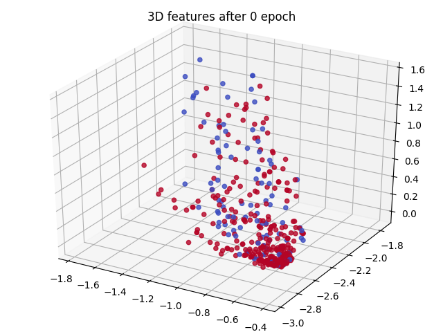

# Homework 1 for Deep Learning

## Environment

* ubuntu 16.04 LTS
* python2.7.12 (using Pycharm 2018.1)
* extra modules: numpy, scipy, pandas, sklearn, matplotlib, mpl_toolkits, prettytable

## Usage of each file

### DNN for Regression

In this task I construct a DNN with 2 hidden layers, trained  on [energy efficiency data](https://www.slideshare.net/NitinAgarwal53/exploratory-data-analysis-for-energy-efficiency) 
with learning rate 0.01 and 192 batch size, 20000 epochs. I also tried some works to see how different feature can effect the target "Heat Load".
 
Here is my procedure of the whole process:
 
1. Train the model with all the features, with categorical features transformed to one-hot vector.
2. Add random gaussian noise with variance = 1 to each non-categorical features on test data one by one, 
and evaluate the error with trained model.
3. Same with the previous process, but this time add noise on the training data, and re-train the model each time 
to see how it effect the training process.
 
To do this, type the following command:
 
```
python dnn_regression.py Dataset/energy_efficiency_data.csv
```
 
First it will output the training error every 1000 epochs, and display some info after training.
 
```
Epoch 0 : train loss 24.405041777
Epoch 1000 : train loss 8.54057721589
Epoch 2000 : train loss 6.4193690632
Epoch 3000 : train loss 3.49790547671
Epoch 4000 : train loss 3.3040381106
Epoch 5000 : train loss 3.49445730076
Epoch 6000 : train loss 3.41025103306
Epoch 7000 : train loss 3.34459334774
Epoch 8000 : train loss 3.28774644151
Epoch 9000 : train loss 3.23153142646
Epoch 10000 : train loss 3.17124037951
Epoch 11000 : train loss 3.12799759998
Epoch 12000 : train loss 3.09561898207
Epoch 13000 : train loss 3.05702882765
Epoch 14000 : train loss 3.0185222152
Epoch 15000 : train loss 2.98180372469
Epoch 16000 : train loss 2.94677507178
Epoch 17000 : train loss 2.91330852608
Epoch 18000 : train loss 2.88144641299
Epoch 19000 : train loss 2.85046916764
+----------------------+--------------------+
| Network architecture |   16 - 6 - 3 - 1   |
+----------------------+--------------------+
|  Selected features   |        all         |
|  Training RMS Error  | 3.4253334085009164 |
|    Test RMS Error    | 3.6876408304445087 |
+----------------------+--------------------+
```
Then it will plot the learning curve, the model regression result with training label and test label.


Second, it will output the test error with different noisy feature on test data.

```
+------------------------+--------------------+
|     Noisy feature      |   Test RMS error   |
+------------------------+--------------------+
| # Relative Compactness | 14.345967087770902 |
|      Surface Area      | 6.900519220036703  |
|       Wall Area        | 18.899218754177124 |
|       Roof Area        | 18.380206160524704 |
|     Overall Height     | 19.19770431349753  |
|      Glazing Area      | 15.76522953786595  |
+------------------------+--------------------+
```

Third, it will re-train the model with different noisy feature on training data, and display 
the same format of information as in first step.
 
```
+----------------------+------------------------+
| Network architecture |     16 - 6 - 3 - 1     |
+----------------------+------------------------+
|    Noisy feature     | # Relative Compactness |
|  Training RMS Error  |   4.042579870888191    |
|    Test RMS Error    |   4.119018470355964    |
+----------------------+------------------------+
+----------------------+-------------------+
| Network architecture |   16 - 6 - 3 - 1  |
+----------------------+-------------------+
|    Noisy feature     |    Surface Area   |
|  Training RMS Error  | 3.761311704457152 |
|    Test RMS Error    | 4.066699109668942 |
+----------------------+-------------------+
+----------------------+--------------------+
| Network architecture |   16 - 6 - 3 - 1   |
+----------------------+--------------------+
|    Noisy feature     |     Wall Area      |
|  Training RMS Error  | 5.0194364724117975 |
|    Test RMS Error    | 4.864448268444225  |
+----------------------+--------------------+
+----------------------+-------------------+
| Network architecture |   16 - 6 - 3 - 1  |
+----------------------+-------------------+
|    Noisy feature     |     Roof Area     |
|  Training RMS Error  | 4.419451616095532 |
|    Test RMS Error    | 4.477068223173597 |
+----------------------+-------------------+
+----------------------+-------------------+
| Network architecture |   16 - 6 - 3 - 1  |
+----------------------+-------------------+
|    Noisy feature     |   Overall Height  |
|  Training RMS Error  | 4.158898799714293 |
|    Test RMS Error    | 4.228433691937008 |
+----------------------+-------------------+
+----------------------+-------------------+
| Network architecture |   16 - 6 - 3 - 1  |
+----------------------+-------------------+
|    Noisy feature     |    Glazing Area   |
|  Training RMS Error  | 4.191562604321912 |
|    Test RMS Error    | 4.697361991503613 |
+----------------------+-------------------+
```
 
Also the figures.
 


 
### DNN for Classification (training)
 
In this task I construct a DNN with 3 hidden layers, trained on [spambase dataset](https://archive.ics.uci.edu/ml/datasets/spambase) with learning rate 0.1 and 400 batch size, 2000 epochs.

First, type the following command:

```
python dnn_classification.py Dataset/spam_data.mat
```

It will output the training loss every 100 epochs, and display some info after training. 
Here the loss is cross-entropy, and the error is the predict error.

```
Epoch 0 : train loss 12.2224802947
Epoch 100 : train loss 1.30029065787
Epoch 200 : train loss 0.766311843483
Epoch 300 : train loss 0.547719712429
Epoch 400 : train loss 0.414546033839
Epoch 500 : train loss 0.329036094709
Epoch 600 : train loss 0.281978811159
Epoch 700 : train loss 0.257099727186
Epoch 800 : train loss 0.23714828535
Epoch 900 : train loss 0.211604797499
Epoch 1000 : train loss 0.18839729367
Epoch 1100 : train loss 0.169516882138
Epoch 1200 : train loss 0.145566777697
Epoch 1300 : train loss 0.127242806263
Epoch 1400 : train loss 0.114697702761
Epoch 1500 : train loss 0.105357296344
Epoch 1600 : train loss 0.0983263896242
Epoch 1700 : train loss 0.0929847967828
Epoch 1800 : train loss 0.088835603964
Epoch 1900 : train loss 0.0855189923849
+----------------------+----------------------+
| Network architecture | 40 - 20 - 10 - 5 - 2 |
+----------------------+----------------------+
|    Training loss     | 0.08281486110796431  |
|    Training Error    | 0.007499999999999951 |
|      Test Error      | 0.10399999999999998  |
+----------------------+----------------------+
```


### DNN for Classification (visualization of latent features)

It's almost the same as the previous one, but this time I add one extra layer before the output layer, 
and it will output the latent features of last batch of data at this layer every 100 epochs.

```
python [-n {2,3}] spam_visualize.py Dataset/spam_data.mat
```

Use the flag -n to specify the dimension of latent features layer. Different color means different class.



